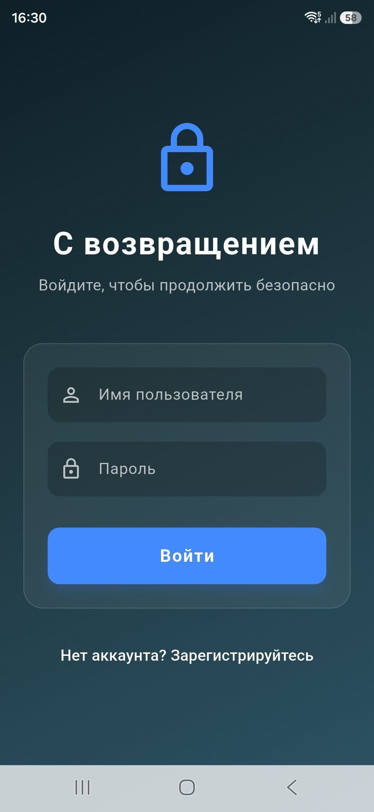
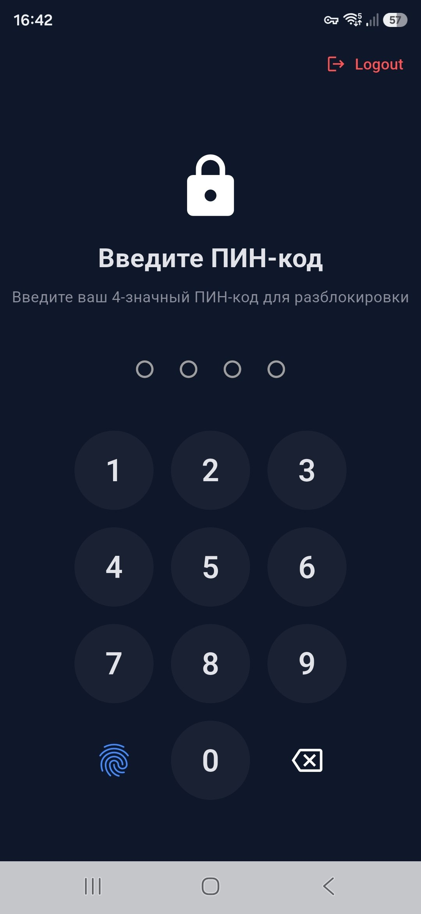
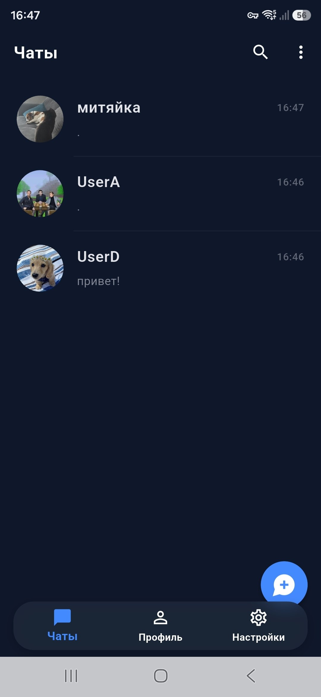
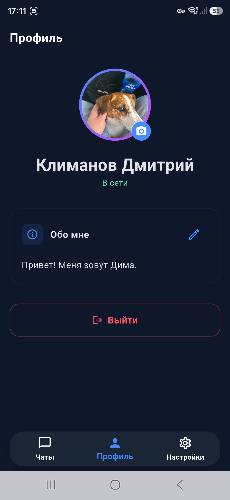
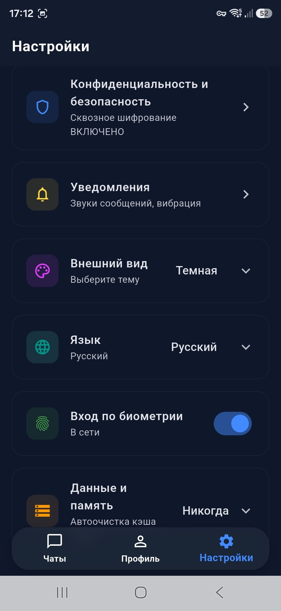
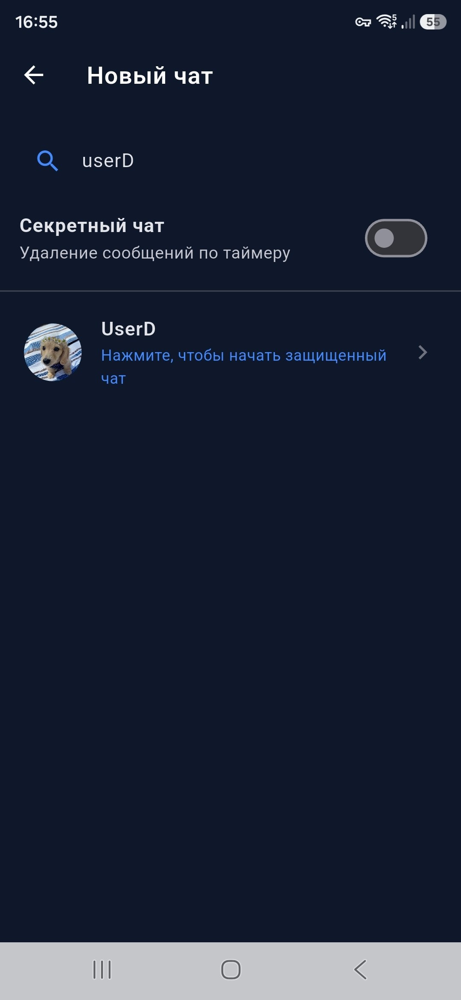
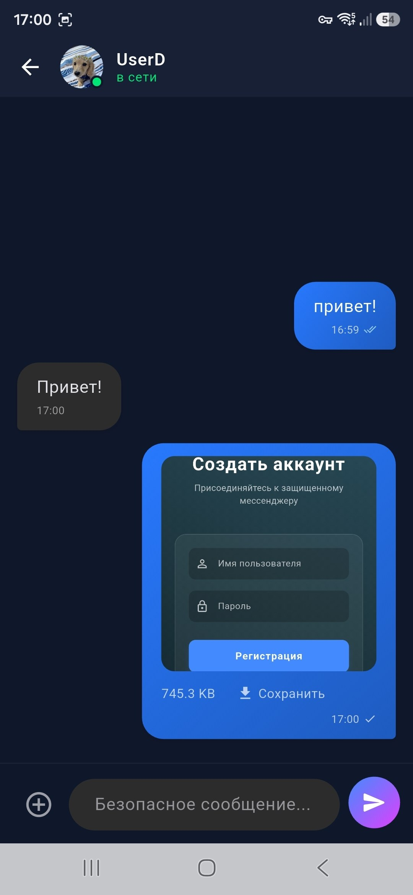
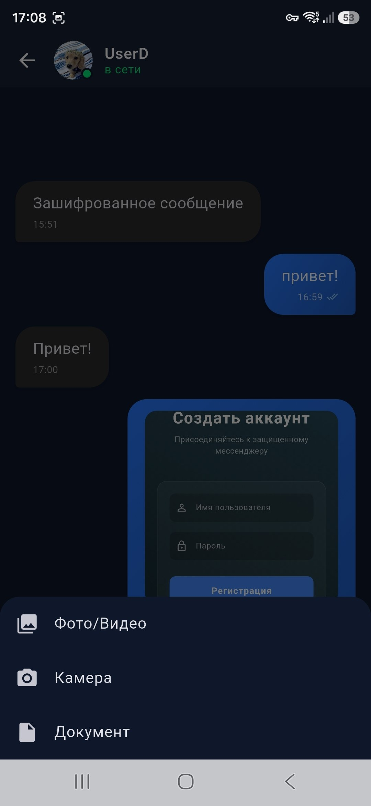
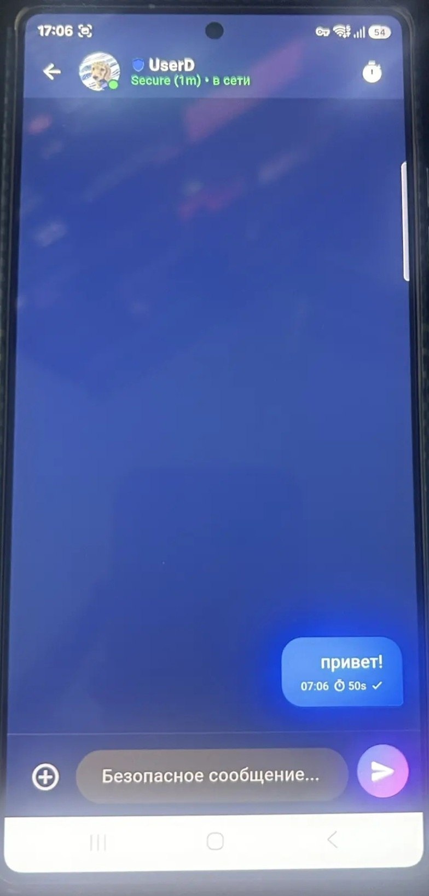
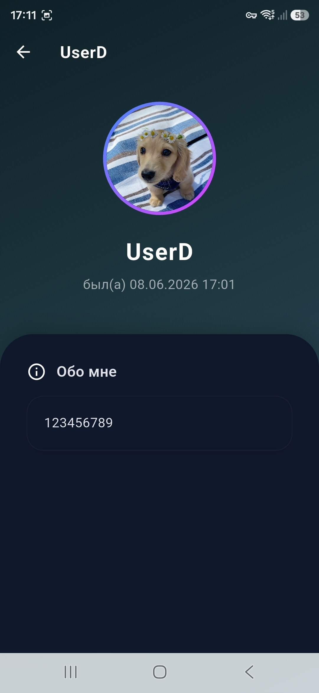

# Secure Messenger Mobile App

Мобильное приложение мессенджера со сквозным шифрованием (E2EE), реализованное на базе фреймворка Flutter.

## Скриншоты приложения

<div align="center">
  
  
  
  
  
  
  
  
  
  
  
  
  
</div>

## Технологический стек
- **Фреймворк**: Flutter / Dart
- **Архитектура**: E2EE для обеспечения безопасной передачи данных
- **Сеть**: WebSockets (Real-time), HTTP/REST для инициализации данных

## Требования
Для успешной сборки и развертывания приложения вам потребуется:
- Flutter SDK (последняя стабильная версия)
- Dart SDK
- Android Studio (с настроенным Android SDK и эмулятором) для сборки под Android
- Xcode для сборки под iOS (доступно только на компьютерах с macOS)

## Инструкция по развертыванию и запуску

1. **Клонирование репозитория:**
   ```bash
   git clone <url-репозитория>
   cd secure_messenger
   ```

2. **Установка зависимостей:**
   Подтяните все необходимые pub-пакеты (библиотеки) для проекта:
   ```bash
   flutter pub get
   ```

3. **Настройка подключения к серверу:**
   Откройте файл конфигурации сетевых запросов (например, константы API) и укажите адрес вашего backend-сервера.
   *Внимание: Если вы запускаете бэкенд локально на компьютере, а эмулятор Android работает на этом же компьютере, используйте IP-адрес `10.0.2.2` вместо `localhost` для доступа к локальному хосту.*

4. **Запуск приложения (Режим разработки):**
   Убедитесь, что у вас запущен эмулятор или по USB подключено реальное устройство, затем выполните:
   ```bash
   flutter run
   ```

## Сборка релизной версии (Production)

Для генерации установочного файла для конечного пользователя:

**Сборка для Android (APK):**
```bash
flutter build apk --release
```
Готовый установочный файл будет находиться по пути: `build/app/outputs/flutter-apk/app-release.apk`

**Сборка для Android (AppBundle для публикации в Google Play):**
```bash
flutter build appbundle --release
```

**Сборка для iOS:**
```bash
flutter build ios --release
```
